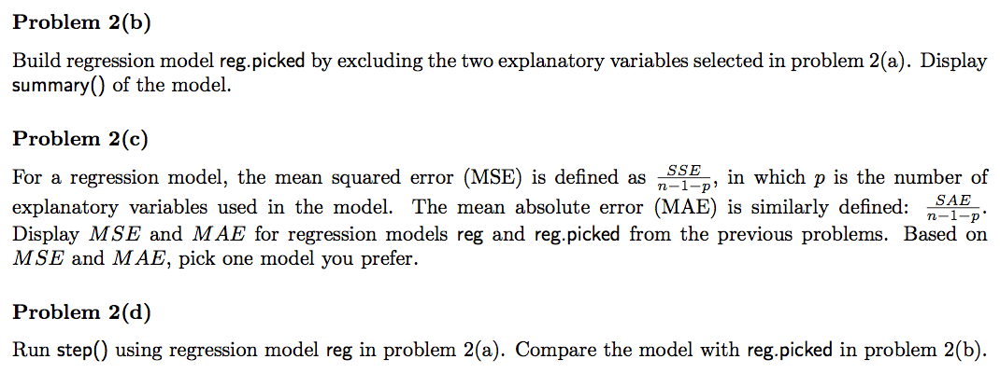
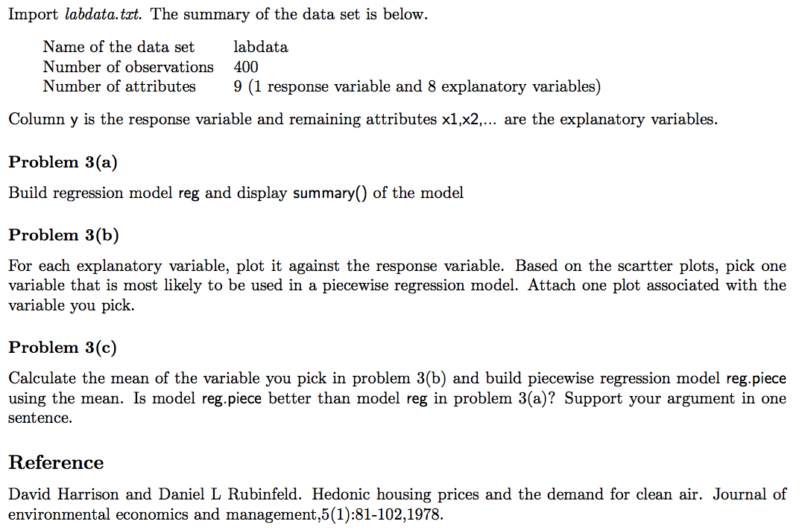

# <font color='red'>Problem 2</font>:




### <font color='blue'>Answer(a)</font>:

```{r}
bostonhousing <-read.table("bostonhousing.txt", header=T)
reg <- lm(MEDV~., data=bostonhousing)
summary(reg)
```
We can see that the variable 'INDUS' and 'AGE' has the highest p-value, so they are least likely to be in the best model.

### <font color='blue'>Answer(b)</font>:
```{r}
reg.picked <- lm(MEDV~ . - INDUS - AGE , data=bostonhousing)
summary(reg.picked)
```


### <font color='blue'>Answer(c)</font>:

##### Calculate MSE and MAR for $reg$
```{r}
n=506
p=13
MSE_reg = sum((reg$residuals)^2)/(n-1-p)
MAE_reg = sum(abs(reg$residuals))/(n-1-p)
```

For $reg$:

  * MSE = `r MSE_reg` 
  
  * MAE = `r MAE_reg` 

##### Calculate MSE and MAR for $reg.picked$
```{r}
n=506
p=11
MSE_reg.picked = sum((reg.picked$residuals)^2)/(n-1-p)
MAE_reg.picked = sum(abs(reg.picked$residuals))/(n-1-p)
```

For $reg.picked$:

  * MSE = `r MSE_reg.picked` 
  
  * MAE = `r MAE_reg.picked` 

Both MSE and MAE for reg.picked are lower than reg. Therefore, I prefer reg.picked to be our model.

### <font color='blue'>Answer(d)</font>:
```{r}
reg.step <- step(reg)
formula(reg.step)
```

Using $step()$, we actually get the same model as $reg.picked$, that is, we use all the variables except 'INDUS' and 'AGE'.


# <font color='red'>Problem 3</font>:


### <font color='blue'>Answer(a)</font>:
```{r}
labdata <-read.table("labdata.txt", header=T)
reg <- lm(y~., data=labdata)
summary(reg)
```

### <font color='blue'>Answer(b)</font>:
```{r}
plot(labdata)
```

From the plot, it's clear that $x1$ will be the variable that we should pick for the piecewise regression model.

```{r}
library(ggplot2)
ggplot(aes(x1, y), data=labdata) + geom_point()
```


### <font color='blue'>Answer(c)</font>:
```{r}
mean_x1=mean(labdata$x1)
reg.piece= lm(y ~ (x1<mean_x1)*x1, data=labdata)
summary(reg.piece)
```

Calculate MSE for $reg$ and $reg.piece$
```{r}
n=400
p=8
MSE_reg = sum((reg$residuals)^2)/(n-1-p)
print(paste('MSE for reg:',MSE_reg))

n=400
p=3
MSE_reg.piece = sum((reg.piece$residuals)^2)/(n-1-p)
print(paste('MSE for reg.piece:',MSE_reg.piece))
```

We can see that the MSE for $reg.piece$ is lower than $reg$ and that the R-square of $reg.piece$ is larger than $reg$, so the model $reg.piece$ is better than model $reg$ in problem 3(a).

