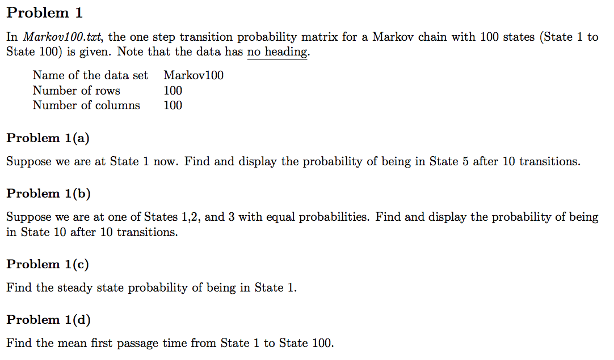
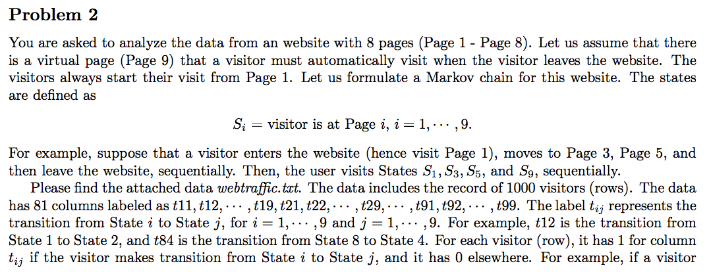
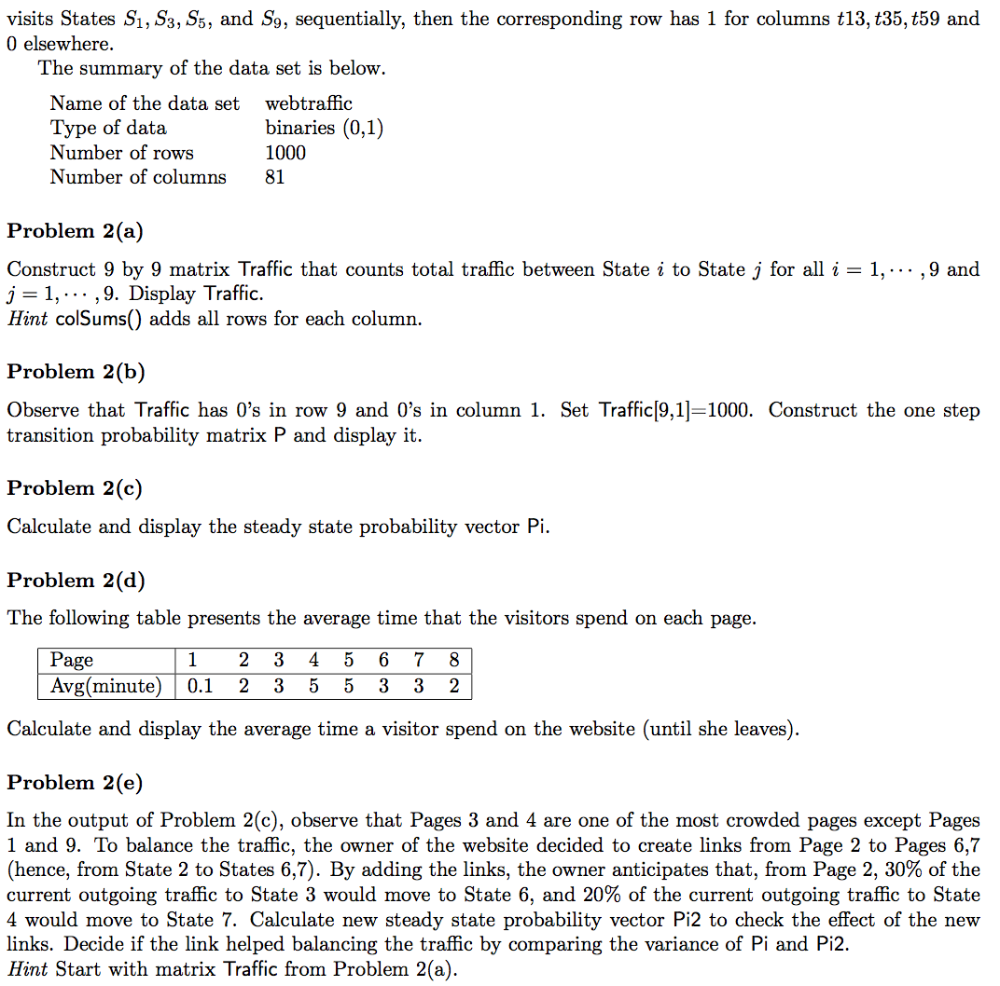

```{r,echo=FALSE, message=FALSE, warning=FALSE}
library(dplyr)
library(knitr)
library(cvTools)
library(expm)
```

## <font color='blue'>Problem 1</font>


### Answer 1(a)
```{r}
# read data
markov <- read.table('_data/markov100.txt', header = FALSE)
```


```{r}
P = as.matrix(markov)
a_1 = c(1,rep(0,99))
a_1_t10 = a_1 %*% (P %^%10)
```
The probability of being in State 5 after 10 transitions is `r a_1_t10[5]`.


### Answer 1(b)
```{r}
a_2 = c(rep(1/3,3),rep(0,97))
a_2_t10 = a_2 %*% (P %^%10)
```

The probability of being in State 10 after 10 transitions is `r a_2_t10[10]`.

### Answer 1(c)
```{r}
size = dim(P)[1]
Q = t(P)-diag(size)
Q[size,] = rep(1,size)
rhs = c(rep(0,size-1),1)
Pi = solve(Q) %*% rhs
```
The steady state probability of being in State 1 is `r Pi[1]`

### Answer 1(d)
```{r}
B =P[1:size-1,1:size-1]
Q = diag(size-1) - B
e = c(rep(1, size-1))
m = solve(Q) %*% e
```
The mean first passage time from state 1 to state 100 is `r m[1]`

## <font color='blue'>Problem 2</font>




### Answer 2(a)
```{r}
# read data
web = read.table('_data/webtraffic.txt', header=TRUE)
```

```{r}
Traffic_list =  colSums(web)
Traffic = as.matrix(data.frame(split(Traffic_list, 1:9)))
Traffic
```


### Answer 2(b)
```{r}
Traffic[9,1] = 1000
P=Traffic/rowSums(Traffic)
P
```

### Answer 2(c)
```{r}
size = dim(P)[1]
Q = t(P)-diag(size)
Q[size,] = rep(1,size)
rhs = c(rep(0,size-1),1)
Pi = solve(Q) %*% rhs
```

```{r, echo=FALSE, results='asis'}
library(knitr)
table_2c <- data.frame(state=paste("P",seq(1:size),sep=""), steady_prob=Pi)
rownames(table_2c) <- NULL
kable(table_2c)
```


### Answer 2(d)
```{r}
traffic_view = colSums(Traffic)[1:8]
avg_min = c(0.1,2,3,5,5,3,3,2)
avg_time_per_visitor = sum(traffic_view*avg_min)/1000
```
The average time that a visitor spend on the website is `r avg_time_per_visitor`

### Answer 2(e)
```{r}
Traffic2 = Traffic
# From Page 2, 30% of the current outgoing traffic to State 3 would move to State 6.
Traffic2[2,3] = Traffic[2,3] - Traffic[2,3]*0.3
Traffic2[2,4] = Traffic[2,4] - Traffic[2,4]*0.2

# From Page 2, 20% of the current outgoing traffic to State 4 would move to State 7. 
Traffic2[2,6] = Traffic[2,6] + Traffic[2,3]*0.3
Traffic2[2,7] = Traffic[2,7] + Traffic[2,4]*0.2
```

```{r}
P2 = Traffic2/rowSums(Traffic2)
size2 = dim(P2)[1]
Q2 = t(P2)-diag(size2)
Q2[size2,] = rep(1,size2)
rhs2 = c(rep(0,size2-1),1)
Pi2 = solve(Q2) %*% rhs2
```

```{r, echo=FALSE, results='asis'}
library(knitr)
table_2e <- data.frame(state=paste("P",seq(1:size2),sep=""), steady_prob=Pi2)
rownames(table_2e) <- NULL
kable(table_2e)
```

```{r, echo=FALSE, results='asis'}
table_2e_2 <- data.frame(name=c('Pi','Pi2'), variance=c(var(Pi),var(Pi2)))
kable(table_2e_2)
```

Yes, the link helped balancing the traffic, since the variance of Pi2 is lower than Pi.